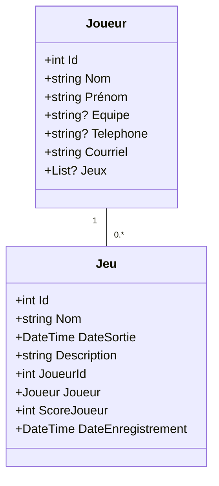

# Informations
Il s'agit d'une application qui permet de gérer des joueurs et des sessions de jeux, et d'afficher les scores sur un tableau de bord.

# Instructions
- Faites un fork du dépôt.
- Donnez-moi les droits d'accès à votre projet.
- Faites des commit régulièrement. 

# Description du modèle 
Vous avez 2 classes modèles **_Jeu_** et **_Joueur_** dans le projet. 
- Un Joueur peut jouer à plusieurs sessions de jeux. 
- Un jeu peut-être joué par un et un seul joueur (pour simplifier l'application). 
- Un jeu ne peut pas exister sans joueurs. 
- Lorsqu'un jeu existe, il doit être joué par un joueur.



-----------------------------------------

## Validations
Classe joueur:
- [ ] Tous les champs sont obligatoires sauf _Equipe_ et _Telephone_.
- [ ] Le champs équipe doit avoir 2 à 4 lettres majuscules.
- [ ] Les champs nom et prénom doivent entre 2 et 20 caractères.
- [ ] Le champ courriel doit être une adresse courriel valide, de format _Identifiant@scoreboard.ca_. _Identifiant_ étant l'identifiant du joueur. Vous avez le choix de la méthode de validations (client et/ou serveur).

Classe jeu
- [ ] Tous les champs sont requis.
- [ ] Les propriété _DateSortie_ et _DateEnregistrement_ doivent être des dates antérieures à la date du jour.
- [ ] L'identifiant du joueur doit exister.
- [ ] Le score doit être compris entre 0 et 100.

## La base de données
- [ ] Créez une base de donnée et liez là au projet.
- [ ] Ajoutez les annotations et propriétés nécessaires pour compléter le modèle
- [ ] Créez la classe de couche d'accès aux données.
- [ ] Créez une migration et générer la base de données.
- [ ] Créer une classe statique pour initialiser les données. Vous trouverez des listes de joueurs et de jeux dans la section Annexe plus bas, elles doivent être modifiées pour réfléter vos ajouts au modèle.

## Le modèle référentiel 
- [ ] Implémentez l'interface **_IJoueurRepository_** (i.e. Créez la classe qui implémente l'interface **_IJoueurRepository_**). 
- [ ] Créez une interface pour le modèle Jeu et implémentez la.

## Implémentation des contrôleurs et des vues
### Contrôleur et vues de Joueur 
Implémentez le contrôleur **_JoueurController_** et les vues du dossier _Views/Joueur_ de façon à avoir les options suivantes:
- [ ] Affichage de tous les joueurs (vue _Index_). 
    - [ ] Pour chaque joueur, on doit avoir la possibilité de supprimer et modifier un joueur.
- [ ] Modification d'un joueur (vue _Modifier_).
- [ ] Suppression d'un joueur avec confirmation de suppression (vue _supprimer_): la suppression d'un joueur nous renvoie vers une vue de confirmation de la suppression du joueur. Cette vue doit avoir 2 boutons, un pour confirmer la suppression et l'autre pour l'annuler.

 ## Le modèle de vue (ViewModel)
Un modèle de vue est une classe qui représente les données spécifiques à une vue, et qui est conçu pour répondre aux besoins spécifiques d'une vue. Il est généralement créé en combinant des données provenant de différents modèles de domaine ou d'autres sources de données. 

### Interaction avec le reste de l'application
Le contrôleur remplit les données dans le modèle de vue et les transmet à la vue pour qu'elle puisse les afficher ou les utiliser. Un modèle de vue ne fait pas partie du modèle de données de l'application. Nous n'avons pas besoin d'une interface et d'un repository pour un modèle de vue.

### Le modèle de vue _DashboardViewModel_
Dans l'application scoreboard, le modèle de vue est la classe _DashboardViewModel_, elle se trouve dans le dossier _ViewModels_. Vous pouvez créer d'autres classes dans le dossier _ViewModels_ si celà vous arrange. 

## Les contrôleurs et vues
### Contrôleur et vues de Jeu 
Implémentez le contrôleur **_JeuController_** et les vues de façon à avoir les options suivantes:

- [ ] Affichage de tous les jeux. 
    - [ ] Sur cette page, on doit pouvoir aller à la page de création d'un nouveau jeu. 
    - [ ] Pour chaque jeu, on doit avoir la possibilité de supprimer, modifier et voir les détails d'un jeu.
- [ ] Création d'un jeu.
- [ ] Suppression d'un jeu avec confirmation de suppression.

### Contrôleur et vues du tableau de bord (Dashboard) 
Implémentez le contrôleur DashboardController de façon à 
- [ ] Avoir, dans la page d'accueil, un tableau récapitulatif des scores des joueurs. 
    - Pour chaque joueur, afficher son score dans chaque jeu, ainsi que son score total. 
    - Choisissez la mise en forme de votre choix.

## Mise en forme
- Complétez, au besoin, la mise en forme de votre application.

# Annexe
## Liste de joueurs
```c#
            _listeJoueurs = new List<Joueur>()
            {
                new Joueur { Id = 0, Nom = "Dupont", Prenom = "Jean", Equipe = "AIGL", Telephone = "514-123-4567", Courriel = "jean.dupont@aigles.com",
                             Jeux = new List<Jeu>
                             {
                                 new Jeu { Id = 0, Nom = "The Legend of Zelda: Breath of the Wild", DateSortie = new DateTime(2017, 3, 3), Description = "Jeu d'action-aventure en monde ouvert", ScoreJoueur = 60, DateEnregistrement = DateTime.Now  },
                                 new Jeu { Id = 1, Nom = "Super Mario Odyssey", DateSortie = new DateTime(2017, 10, 27), Description = "Jeu de plateforme en monde ouvert", ScoreJoueur = 50, DateEnregistrement = DateTime.Now },
                                 new Jeu { Id = 2, Nom = "Red Dead Redemption 2", DateSortie = new DateTime(2018, 10, 26), Description = "Jeu d'action-aventure en monde ouvert dans le Far West", ScoreJoueur = 100, DateEnregistrement = DateTime.Now }
                             }
                },
                new Joueur { Id = 1, Nom = "Tremblay", Prenom = "Lucie", Equipe = "RNRD", Telephone = "450-987-6543", Courriel = "lucie.tremblay@renards.com",
                            Jeux = new List<Jeu>
                             {
                                new Jeu { Id = 3, Nom = "Assassin's Creed Odyssey", DateSortie = new DateTime(2018, 10, 5), Description = "Jeu d'action-aventure en monde ouvert dans la Grèce antique", ScoreJoueur = 100, DateEnregistrement = DateTime.Now },
                                new Jeu { Id = 4, Nom = "God of War", DateSortie = new DateTime(2018, 4, 20), Description = "Jeu d'action-aventure en monde ouvert inspiré de la mythologie nordique", ScoreJoueur = 30, DateEnregistrement = DateTime.Now },
                             }
                },
                new Joueur { Id = 2, Nom = "Gagnon", Prenom = "Alexandre", Equipe = "LION", Telephone = "819-345-6789", Courriel = "alexandre.gagnon@lions.com",
                            Jeux = new List<Jeu>
                             {
                                new Jeu { Id = 5, Nom = "Cyberpunk 2077", DateSortie = new DateTime(2020, 12, 10), Description = "Jeu de rôle en monde ouvert futuriste", ScoreJoueur = 70, DateEnregistrement = DateTime.Now},

                             }},
                new Joueur { Id = 3, Nom = "Lapointe", Prenom = "Sophie", Equipe = "TIGR", Telephone = "418-765-4321", Courriel = "sophie.lapointe@tigres.com",
                            Jeux = new List<Jeu>
                             {
                                new Jeu { Id = 6, Nom = "The Last of Us Part II", DateSortie = new DateTime(2020, 6, 19), Description = "Jeu d'action-aventure et de survie post-apocalyptique", ScoreJoueur = 100, DateEnregistrement = DateTime.Now },
                                new Jeu { Id = 7, Nom = "Animal Crossing: New Horizons", DateSortie = new DateTime(2020, 3, 20), Description = "Jeu de simulation de vie en monde ouvert", ScoreJoueur = 10, DateEnregistrement = DateTime.Now },
                                new Jeu { Id = 8, Nom = "Doom Eternal", DateSortie = new DateTime(2020, 3, 20), Description = "Jeu de tir à la première personne", ScoreJoueur = 90, DateEnregistrement = DateTime.Now },
                             }},
                new Joueur { Id = 4, Nom = "Nguyen", Prenom = "Kevin", Equipe = "EPRV", Telephone = "514-876-5432", Courriel = "kevin.nguyen@eperviers.com",
                            Jeux = new List<Jeu>
                             {
                                new Jeu { Id = 9, Nom = "Ghost of Tsushima", DateSortie = new DateTime(2020, 7, 17), Description = "Jeu d'action-aventure en monde ouvert dans le Japon féodal", ScoreJoueur = 100, DateEnregistrement = DateTime.Now },
                                new Jeu { Id = 10, Nom = "Hades", DateSortie = new DateTime(2020, 9, 17), Description = "Jeu de rôle d'action roguelike", ScoreJoueur = 40, DateEnregistrement = DateTime.Now }

                             }
                }
            };
```
## Liste de jeux
```c#
            _listeJeux = new List<Jeu>()
            {
                new Jeu { Id = 0, Nom = "The Legend of Zelda: Breath of the Wild", DateSortie = new DateTime(2017, 3, 3), Description = "Jeu d'action-aventure en monde ouvert", Joueur = joueurRepository.GetJoueur(0), ScoreJoueur = 60, DateEnregistrement = DateTime.Now },
                new Jeu { Id = 1, Nom = "Super Mario Odyssey", DateSortie = new DateTime(2017, 10, 27), Description = "Jeu de plateforme en monde ouvert", JoueurId = 1, Joueur = joueurRepository.GetJoueur(0), ScoreJoueur = 50, DateEnregistrement = DateTime.Now },
                new Jeu { Id = 2, Nom = "Red Dead Redemption 2", DateSortie = new DateTime(2018, 10, 26), Description = "Jeu d'action-aventure en monde ouvert dans le Far West", Joueur = joueurRepository.GetJoueur(0), ScoreJoueur = 100, DateEnregistrement = DateTime.Now },
                new Jeu { Id = 3, Nom = "Assassin's Creed Odyssey", DateSortie = new DateTime(2018, 10, 5), Description = "Jeu d'action-aventure en monde ouvert dans la Grèce antique", Joueur = joueurRepository.GetJoueur(1), ScoreJoueur = 100, DateEnregistrement = DateTime.Now },
                new Jeu { Id = 4, Nom = "God of War", DateSortie = new DateTime(2018, 4, 20), Description = "Jeu d'action-aventure en monde ouvert inspiré de la mythologie nordique", Joueur = joueurRepository.GetJoueur(1), ScoreJoueur = 30, DateEnregistrement = DateTime.Now },
                new Jeu { Id = 5, Nom = "Cyberpunk 2077", DateSortie = new DateTime(2020, 12, 10), Description = "Jeu de rôle en monde ouvert futuriste", Joueur = joueurRepository.GetJoueur(2), ScoreJoueur = 70, DateEnregistrement = DateTime.Now},
                new Jeu { Id = 6, Nom = "The Last of Us Part II", DateSortie = new DateTime(2020, 6, 19), Description = "Jeu d'action-aventure et de survie post-apocalyptique", Joueur = joueurRepository.GetJoueur(3), ScoreJoueur = 100, DateEnregistrement = DateTime.Now },
                new Jeu { Id = 7, Nom = "Animal Crossing: New Horizons", DateSortie = new DateTime(2020, 3, 20), Description = "Jeu de simulation de vie en monde ouvert", Joueur = joueurRepository.GetJoueur(3), ScoreJoueur = 10, DateEnregistrement = DateTime.Now },
                new Jeu { Id = 8, Nom = "Doom Eternal", DateSortie = new DateTime(2020, 3, 20), Description = "Jeu de tir à la première personne", Joueur = joueurRepository.GetJoueur(3), ScoreJoueur = 90, DateEnregistrement = DateTime.Now },
                new Jeu { Id = 9, Nom = "Ghost of Tsushima", DateSortie = new DateTime(2020, 7, 17), Description = "Jeu d'action-aventure en monde ouvert dans le Japon féodal", Joueur = joueurRepository.GetJoueur(4), ScoreJoueur = 100, DateEnregistrement = DateTime.Now },
                new Jeu { Id = 10, Nom = "Hades", DateSortie = new DateTime(2020, 9, 17), Description = "Jeu de rôle d'action roguelike", Joueur = joueurRepository.GetJoueur(4), ScoreJoueur = 40, DateEnregistrement = DateTime.Now }
            };
```
